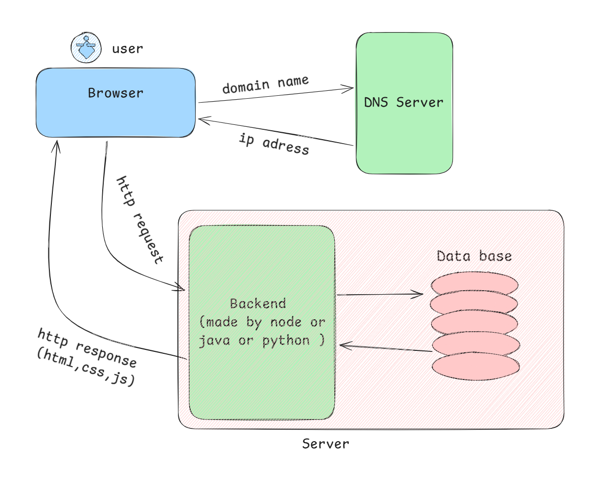

# How Websites Work

## Introduction

Whenever you open a website such as:

```
www.amazon.com
```

a series of steps happen behind the scenes before the webpage appears on your screen.

---

# Step 1: User Enters a Website Address

The user types a website address (URL) into the browser.

**Example:**

```
www.amazon.com
```

The browser now needs to find where this website is located on the Internet.

---

# Step 2: DNS Finds the Website Address

The browser asks the **DNS (Domain Name System)**:

> "What is the IP address of amazon.com?"

DNS responds with the server's IP address.

**Example:**

```
amazon.com → 54.xx.xx.xx
```

### Real-Life Analogy

DNS works like your phone contacts.

```
Mom → 9876543210
amazon.com → 54.xx.xx.xx
```

You remember the name, while the system remembers the actual address.

---

# Step 3: Browser Sends a Request

After getting the IP address, the browser sends a request to the server.

The request simply means:

> "Please send me the webpage."

```
Browser → Server
```

---

# Step 4: Server Receives the Request

A **Server** is a powerful computer that stores website files.

The server receives the browser's request and prepares the required webpage.

```
Browser → Server
```

---

# Step 5: Server Sends Website Files

The server sends different types of files back to the browser.

| File Type | Purpose |
|------------|----------|
| HTML | Structure of the page |
| CSS | Design and styling |
| JavaScript | Interactivity |
| Images | Visual content |

```
Server → Browser
```

---

# Step 6: Browser Builds the Webpage

The browser combines all received files:

```
HTML + CSS + JavaScript + Images
```

and creates the final webpage that the user sees.

---

# Complete Flow

```text
User
 ↓
Browser
 ↓
DNS
 ↓
IP Address Found
 ↓
Request Sent to Server
 ↓
Server Processes Request
 ↓
HTML, CSS, JS, Images Returned
 ↓
Browser Displays Webpage
```

---

# Restaurant Analogy

Understanding websites becomes easier with a restaurant example.

| Website Component | Restaurant Equivalent |
|-------------------|----------------------|
| User | Customer |
| Browser | Waiter |
| Server | Kitchen |
| Website Files | Food |

### Flow

```text
Customer places an order
        ↓
Waiter takes the order
        ↓
Kitchen prepares the food
        ↓
Waiter brings the food
        ↓
Customer receives the food
```

Similarly:

```text
User requests webpage
        ↓
Browser sends request
        ↓
Server prepares webpage
        ↓
Server sends files
        ↓
Browser displays webpage
```

---

# Key Terms

## Browser

Software used to access websites.

Examples:

- Google Chrome
- Mozilla Firefox
- Microsoft Edge

---

## Server

A computer that stores website files and responds to user requests.

---

## DNS

Domain Name System.

Converts human-friendly website names into IP addresses.

**Example:**

```
google.com → 142.xx.xx.xx
```

---

## Request

A message sent by the browser asking the server for a webpage.

---

## Response

The data returned by the server to the browser.

---

# Summary

1. User enters a website address.
2. DNS finds the website's IP address.
3. Browser sends a request to the server.
4. Server processes the request.
5. Server returns HTML, CSS, JavaScript, and images.
6. Browser combines these files and displays the webpage.

## One-Line Definition

> A website works by sending a request from the browser to a server, and the server responds with the files needed to display the webpage.

